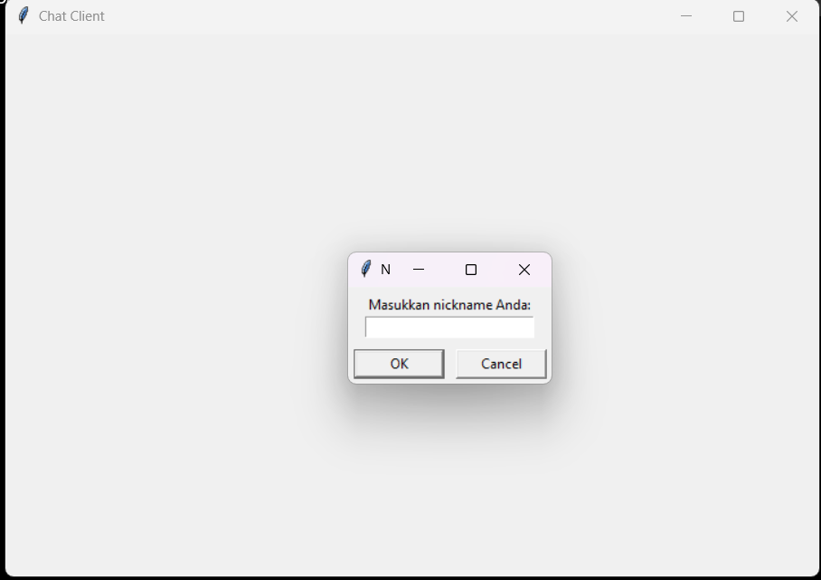
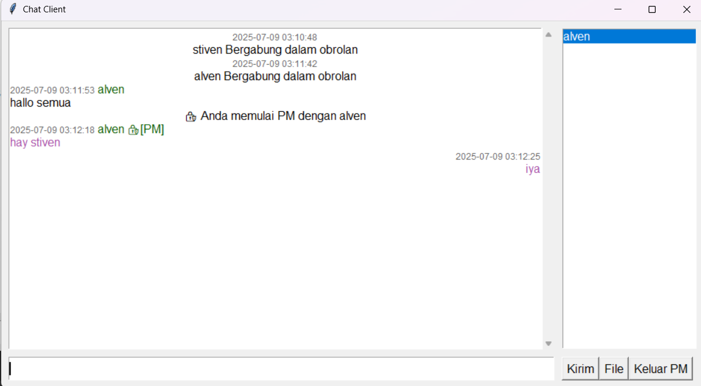

# 💬 ChatApp Client-Server

Aplikasi chat desktop berbasis Python dengan antarmuka grafis (Tkinter) dan protokol socket TCP. Proyek ini dibuat untuk memenuhi UAS mata kuliah **Pemrograman Client-Server**.

---

## 🚀 Fitur

- 🧑‍💬 **Login & Nickname Management**
- 💬 **Chat publik & pesan pribadi (PM)**
- 📁 **Kirim file publik maupun privat**
- 🎨 **Antarmuka GUI responsif (Tkinter)**
- 👥 **Daftar user online**
- 🧠 **Auto reconnect & nickname persistence (via config)**

---

## 📸 Tampilan Aplikasi

### Tampilan Antarmuka Client



### Tampilan Chat Area & User List



---

## 🛠️ Cara Menjalankan Aplikasi

### 💻 Server:

```bash
python server.py
```

Masukkan IP server (default: 127.0.0.1)
Masukkan port (default: 65432)
Jalankan di 1 komputer/server

### 💻 client:

```bash
python client.py
```

Masukkan IP server dan port sesuai
Jalankan di 1 atau lebih komputer untuk simulasi client

### 🧠 Teknologi yang Digunakan

-- **Python 3**
**Tkinter (GUI)**
**socket, threading, struct, json, dll**
**Format pesan: custom header (msgType + msgLen) + payload**
**Local file management: simpan dan buka file via RAM/Folder**
